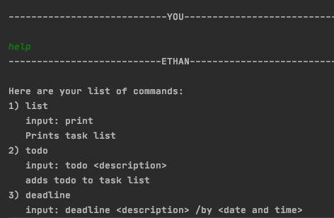
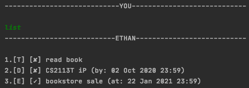
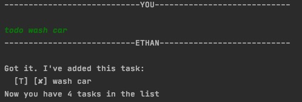
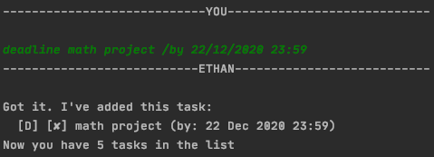
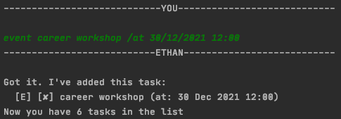
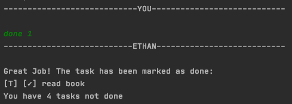
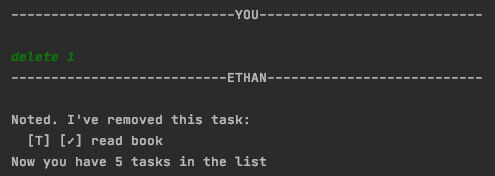
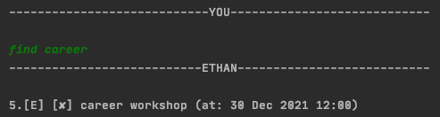

# User Guide

Ethan is a handy personal task manager which will help you maintain your task list through the Command Line Interface (CLI).

* [Quick Start](#quick-start)
* [Features](#features)
    + [1. View help: `help`](#1-view-help-help)
    + [2. View task list: `list`](#2-view-task-list-list)
    + [3. Add todo: `todo`](#3-add-todo-todo)
    + [4. Add deadline: `deadline`](#4-add-deadline-deadline)
    + [5. Add event: `event`](#5-add-event-event)
    + [6. Mark Done: `done`](#6-mark-done-done)
    + [7. Delete task: `delete`](#7-delete-task-delete)
    + [8. Find task: `find`](#8-find-task-find)
    + [9. End program: `bye`](#9-end-program-bye)
* [FAQ](#faq)
* [Command Summary](#command-summary)

## Quick Start

1. Ensure that you have Java `11` installed in your computer.
2. Download the latest ip.jar from  link.
3. Copy the file to a folder you want to store your tasks.
4. Launch the command prompt and navigate to the folder ip.jar is stored in.
5. Run ip.jar in the command prompt `(java -jar ip.jar)`
6. Type commands in the command prompt and press Enter to run commands. e.g. type `help` and Enter to see commands available
7. Refer to features section below for other commands

## Features 
```
Notes about command format:
* Words in **CAPITAL LETTERS** are parameters users input.
e.g. for ``todo DESCRIPTION``, `DESCRIPTION` is a parameter the user provides such as `todo buy shirts` 
```

There are **3** types of task, **todo**,**deadlines** and **events**

Following is a list of commands at your disposal:
* `help`- View help
* `list`- View task list
* `todo`- Add todo
* `deadline`- Add deadline
* `event`- Add event
* `done`- Mark done
* `delete`- Delete task
* `find`- Find tasks
* `bye`- End program

### 1. View help: `help`
Shows the commands and their respective input formats

**Format:** `help`

**Outcome:**



### 2. View task list: `list`
Shows list of tasks

**Format:** `list`

**Outcome:**




### 3. Add todo: `todo` 
Adds a todo task to task list

**Format:** `todo DESCRIPTION` 

**Example:** `todo wash car`
  *Adds a todo task with description "wash car" to task list

**Outcome:**




### 4. Add deadline: `deadline`
Adds a deadline task to task list

**Format**: `deadline DESCRIPTION /by DATE TIME`
 
 * `DATE` must be in **dd/MM/yyyy** format. e.g. `9/12/2020` for 9th december 2020
 * `TIME` must be in **HH:mm** 24 hours time format. e.g. `22:59` for 10:59pm.
* `DATE TIME` must be in future

**Example:** `deadline math project /by 22/12/2020 23:59`

* Adds a deadline task with description "deadline math project", by "22nd December 2020 23:59"

**Outcome:**




### 5. Add event: `event`
Adds an event to task list

**Format:** `event DESCRIPTION /at DATE TIME`

* `DATE` must be in **dd/MM/yyyy** format. e.g. `9/12/2020` for 9th december 2020
* `TIME` must be in **HH:mm** 24 hours time format. e.g. `22:59` for 10:59pm.
* `DATE TIME` must be in future

**Example:** `event career workshop /at 30/12/2021 12:00`

* Adds a event task with description "event career workshop", at "30th December 2021 12:00"

**Outcome:**




### 6. Mark done: `done`
Marks a task in task list as done

**Format:** `done TASKNUMBER`

* `TASKNUMBER` must be an integer.

**Example:** `done 1`

*Marks task with task number 1 as done.

**Outcome:**




### 7. Delete task: `delete`
Deletes a task from task list

**Format:** `delete TASKNUMBER`

* `TASKNUMBER` must be an integer.

**Example** `delete 1`

* Deletes task with task number 1.

**Outcome:**




### 8. Find task: `find`
Finds task from task list based on `KEYWORD` and description.

**Format:** `find KEYWORD`

**Example** `find career`

* Finds and shows tasks with "career" in description.

**Outcome:**




### 9. End program: `bye`
Ends program before saving and updating task list

**Format** `bye`

## Command Summary
Action | Format | Example
-------- | --------- | ---------
help | `help` | 'help'
list | `list` | `list`
todo | `todo DESCRIPTION` | `todo buy some milk`
deadline | `deadline DESCRIPTION /by DATE TIME (dd/MM/yyyy HH:mm)` | `deadline CS hw /by 28/02/2021 23:59`
event | `event DESCRIPTION /at DATE TIME (dd/MM/yyyy HH:mm)` | `deadline Christmas party /at 25/12/2020 17:00 `
done | `done TASKNUMBER` | `done 4`
delete | `delete TASKNUMBER` | `delete 2`
find | `find KEYWORD` | `find party`
bye | `bye` | `bye`
